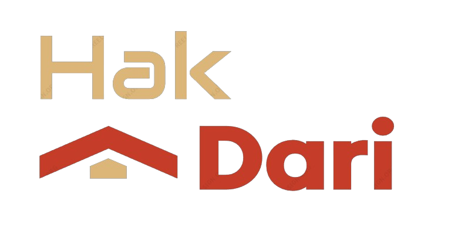

 ****Real Estate Agency Management Application****

## License
This project is licensed under the Proprietary License. See the [LICENSE](LICENSE.md) file for details.

## Contributor License Agreement
To contribute to this project, you must first sign our Contributor License Agreement (CLA). This ensures that 
we have the legal rights to use your contributions. Please visit the 
to sign the agreement before making any contributions.

# Presentation 
[presentation](https://www.canva.com/design/DAGF-pa3_S4/uxGe03O4zGjDtNg7XfwRlw/edit?utm_content=DAGF-pa3_S4&utm_campaign=designshare&utm_medium=link2&utm_source=sharebutton)

# report 
[report](https://www.canva.com/design/DAGFh_XT-qw/Mjw0qgLEsB6JCybB56AOxg/edit?utm_content=DAGFh_XT-qw&utm_campaign=designshare&utm_medium=link2&utm_source=sharebutton)
